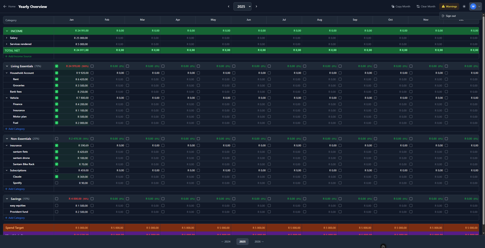
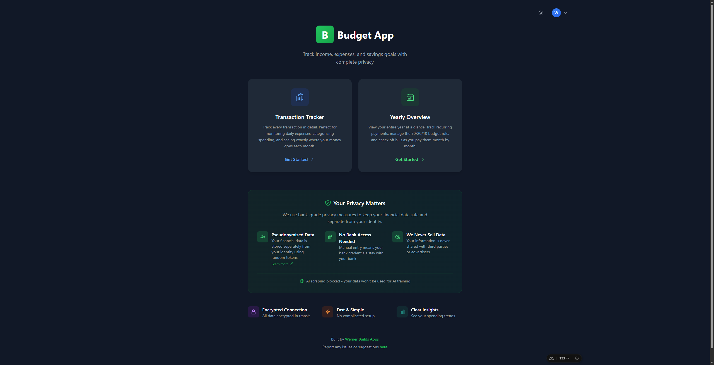
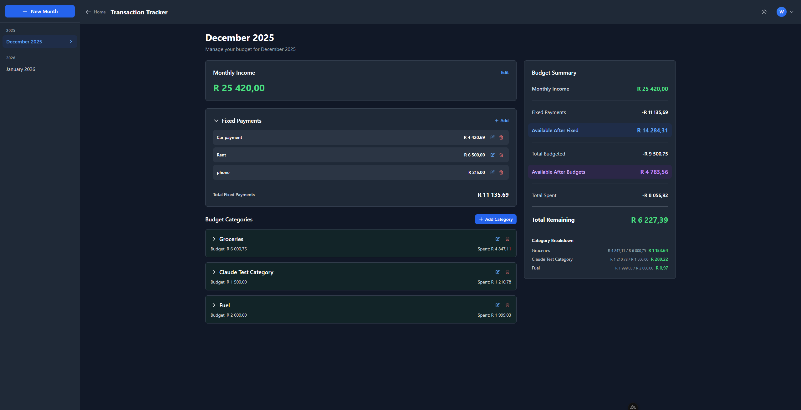
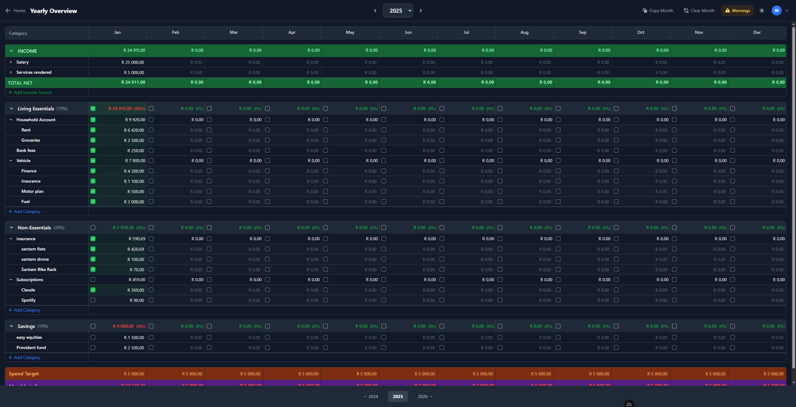
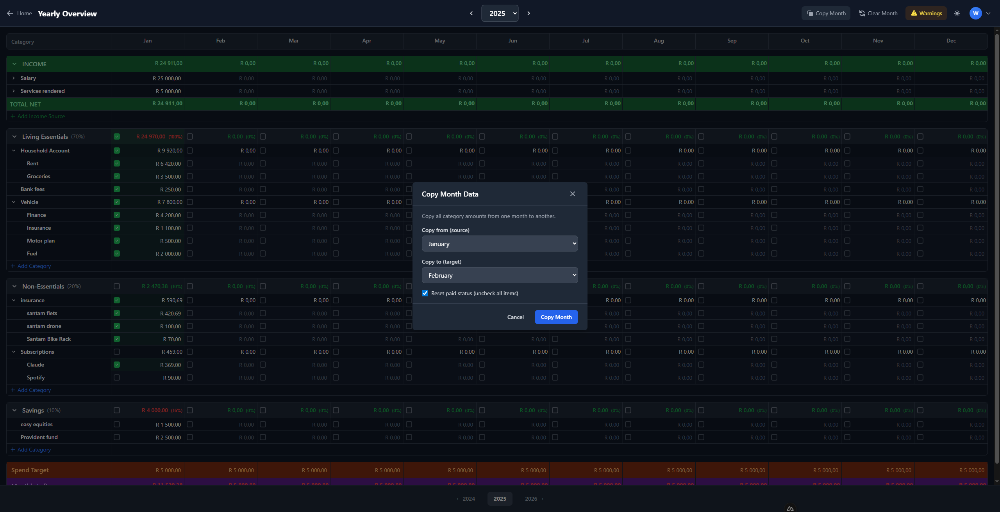
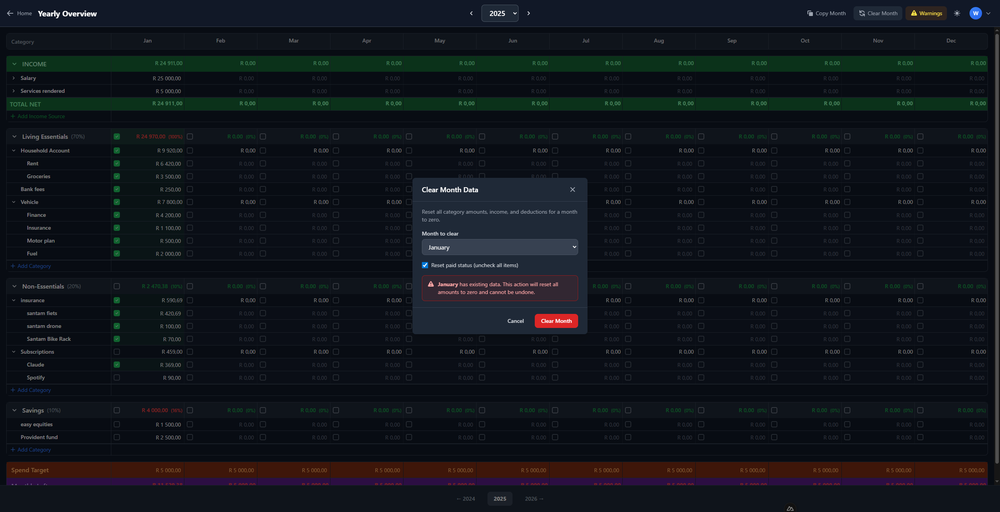

# Budget App - User Guide

Welcome to your personal budgeting app! This guide will help you get started and make the most of all the features.

---

## Table of Contents

1. [Getting Started](#getting-started)
2. [Transaction Mode](#transaction-mode)
3. [Yearly Overview Mode](#yearly-overview-mode)
4. [Tips & Tricks](#tips--tricks)

---

## Getting Started

### Creating an Account

1. Open the app and click **Sign Up**
2. Enter your email address
3. Create a password (must be at least 8 characters with 1 number and 1 special character)
4. Confirm your password
5. Click **Create Account**
6. Check your email for a confirmation link and click it to verify your account

### Logging In

1. Enter your email and password
2. Click **Sign In**
3. If you forgot your password, click "Forgot password?" to receive a reset link


### Logging Out

To sign out of the app:

1. Click your profile icon (shows your initial) in the top right corner
2. Click **Sign out** from the dropdown menu



### Choosing Your Mode

After logging in, you'll see the home screen with two options:

- **Transaction Tracker** - Track daily expenses month by month. Best for detailed expense tracking where you want to log every purchase.
- **Yearly Overview** - Plan your entire year with the 70/20/10 budgeting method. Best for annual planning and tracking recurring monthly expenses.



---

## Transaction Mode

Transaction Mode helps you track your monthly income and expenses in detail. This is ideal for people who want to track every individual purchase.

### Creating Your First Month

1. Click on **Transaction Tracker** from the home screen
2. Click **+ New Month** in the sidebar
3. Select the year and month
4. Click **Create**

### Setting Your Monthly Income

1. Find the **Monthly Income** card at the top
2. Click **Edit** to change it
3. Enter your monthly income (e.g., 25000)
4. Press **Enter** or click the checkmark to save

### Adding Fixed Payments

Fixed payments are recurring expenses like rent, subscriptions, or loan payments that stay the same each month.

1. Find the **Fixed Payments** section
2. Click **+ Add**
3. Enter the name (e.g., "Rent", "Netflix", "Car Payment")
4. Enter the amount
5. Press **Enter** to save

### Creating Budget Categories

Categories help you organize your spending (e.g., Groceries, Transport, Entertainment).

1. Click **+ Add Category**
2. Enter the category name
3. Enter the budgeted amount for this category
4. Press **Enter** to save

### Adding Transactions

Transactions are individual purchases or expenses within a category.

1. Click on a category to expand it
2. Click **+ Add Transaction**
3. Enter what you bought (e.g., "Pick n Pay groceries")
4. Enter the amount spent
5. Select the date
6. Press **Enter** to save

### Understanding the Budget Summary

The summary card on the right shows your financial overview:

| Field | Description |
|-------|-------------|
| **Monthly Income** | Your total monthly income |
| **Fixed Payments** | Total of recurring expenses |
| **Available After Fixed** | What's left after fixed payments |
| **Total Budgeted** | How much you've allocated to categories |
| **Available After Budgets** | Unallocated money |
| **Total Spent** | What you've actually spent |
| **Total Remaining** | Money still available (green = good, red = overspent) |



---

## Yearly Overview Mode

Yearly Overview Mode helps you plan your entire year using the **70/20/10 budgeting method**:

| Section | Percentage | Purpose |
|---------|------------|---------|
| **Living Essentials** | 70% | Essential expenses (housing, food, transport, insurance) |
| **Non-Essentials** | 20% | Non-essential spending (entertainment, hobbies, dining out) |
| **Savings** | 10% | Savings and investments |

### Creating a Yearly Budget

1. Click on **Yearly Overview** from the home screen
2. If no budget exists for the year, click **Create [Year] Budget**
3. The app will create sections for Living Essentials (70%), Non-Essentials (20%), and Savings (10%)

### Understanding the Layout

The yearly view is a spreadsheet-like grid with:
- **Category column** (left, sticky) - Shows all your budget categories
- **Month columns** (Jan-Dec) - Shows amounts for each month
- **Checkboxes** - Mark items as paid
- **Section headers** - Collapsible groups with totals and percentages



### Resizing the Category Column

If you have long category names that get cut off:

1. Look for the **resize handle** on the right edge of the "Category" column header
2. Click and drag it to the right to make the column wider
3. The column will stay at your preferred width

**Tip:** This is especially useful if you have detailed category names like "Vehicle - Insurance Premium" or "Household Account - Electricity".

### Setting Up Income Sources

1. Click the **INCOME** section to expand it
2. Click **+ Add Income Source**
3. Enter the source name (e.g., "Salary", "Side Business", "Rental Income")
4. Click on each month's cell to enter your expected gross income

### Adding Deductions

Deductions are amounts taken from your gross income (tax, medical aid, pension, UIF).

1. Click the **expand arrow** next to an income source
2. You'll see an option to add deductions
3. Enter the deduction name (e.g., "PAYE Tax", "Medical Aid", "Pension")
4. Enter the monthly deduction amount

The **TOTAL NET** row shows your income after all deductions - this is what you actually have to spend.

### Adding Categories

1. Click **+ Add Category** within any section
2. Enter the category name (e.g., "Rent", "Groceries", "Car Finance")
3. Click on each month's cell to enter amounts (Jan-Dec)

### Adding Subcategories

For more detailed tracking, you can nest categories:

1. Hover over a category name
2. Click the **+** icon that appears
3. Enter the subcategory name
4. The parent category total will automatically sum up all its children

**Example:** Create a "Vehicle" category with subcategories:
- Finance (R 4,200)
- Insurance (R 1,100)
- Motor Plan (R 500)
- Fuel (R 2,000)

The "Vehicle" row will automatically show R 7,800.

---

## Understanding Checkboxes (Paid Status)

The checkboxes are one of the most powerful features in Yearly Overview mode. They help you track what you've actually paid each month.

### How Checkboxes Work

- **Empty checkbox** = Not yet paid
- **Green checkbox with tick** = Paid

### Individual Item Checkboxes

Each amount cell has a checkbox next to it. Click it when you've made that payment for the month.

### Section Header Checkboxes

Each section (Living Essentials, Non-Essentials, Savings) has a checkbox in the header row for each month. This shows the overall status:

- **Green tick** = ALL items in that section are marked as paid for that month
- **Empty** = Some or all items still need to be paid

### Bulk Check/Uncheck

To quickly mark all items in a section as paid:

1. Click the checkbox in the section header row (e.g., "Living Essentials" row under "Jan")
2. A confirmation dialog appears to prevent accidents
3. Confirm to mark ALL categories in that section as paid for that month

**Warning:** This will check/uncheck ALL items in the section, so use with care!

---

## Understanding Spend Target & Monthly Leftover

At the bottom of the Yearly Overview, you'll see two important rows:

### Spend Target

This is your **pocket money** - the amount you want to have left over each month for discretionary spending, unexpected expenses, or extra savings.

**How it's calculated:**
```
Spend Target = A fixed amount you want remaining after all budgeted expenses
```

By default, this might show R 5,000 per month. This represents money you haven't allocated to specific categories - your "fun money" or buffer.

### Monthly Leftover

This shows whether you're on track:

```
Monthly Leftover = Net Income - All Budgeted Expenses - Spend Target
```

| Color | Meaning |
|-------|---------|
| **Green (positive)** | You have more money than planned - you're under budget! |
| **Red (negative)** | You've budgeted more than you earn - review your budget |

**Example:**
- Net Income: R 25,000
- Total Budgeted: R 20,000
- Spend Target: R 5,000
- Monthly Leftover: R 0 (perfectly balanced!)

If your Monthly Leftover shows -R 5,000, it means you've over-budgeted by R 5,000 and need to reduce some categories.

---

## Copy Month Feature

Copy Month lets you duplicate all amounts from one month to another - perfect when your expenses are similar month to month.



### How to Use Copy Month

1. Click **Copy Month** in the top toolbar
2. Select the **source month** (copy FROM)
3. Select the **target month** (copy TO)
4. Choose whether to **reset paid status** (recommended for a new month)
5. Click **Copy Month**

### When to Use It

- **Setting up a new year:** Copy December to January, then adjust for any changes
- **Similar months:** If March looks like February, copy it over
- **Templates:** Set up January perfectly, then copy to all other months

### Reset Paid Status Option

- **Checked (recommended):** All checkboxes in the target month will be unchecked - you'll need to mark items as paid again
- **Unchecked:** Keeps the paid status from the source month - use this if you're copying mid-month

---

## Clear Month Feature

Clear Month resets a month's data - useful for starting fresh or fixing mistakes.



### How to Use Clear Month

1. Click **Clear Month** in the top toolbar
2. Select the **month to clear**
3. Choose whether to **reset paid status**
4. Click **Clear Month**

### What Gets Cleared

- All category amounts for that month become R 0.00
- All income entries for that month become R 0.00
- All deductions for that month become R 0.00
- Optionally, all paid checkboxes get unchecked

### Warning

The modal will warn you if the selected month has existing data. **This action cannot be undone**, so make sure you really want to clear the month!

---

## Tips & Tricks

### Dark Mode

Toggle between light and dark mode using the **sun/moon icon** in the top right corner. The app remembers your preference.

### Keyboard Shortcuts

| Key | Action |
|-----|--------|
| **Enter** | Save what you're editing |
| **Escape** | Cancel editing without saving |
| **Tab** | Move to next field |

### Quick Navigation

- Use the **year selector arrows** (< >) to move between years
- Use the **year dropdown** to jump to any year
- The **footer** also has quick year navigation buttons

### Editing Values

- Click on any amount to edit it
- Enter the number without currency symbols (just type "5000", not "R 5000")
- Press **Enter** to save or **Escape** to cancel
- The app automatically formats numbers with thousands separators

### Collapsing Sections

- Click on a **section header** (Income, Living Essentials, etc.) to collapse/expand it
- Click on a **category with subcategories** to collapse/expand its children
- This helps you focus on specific areas of your budget

### The Warnings Button

If you see a **Warnings** button in the toolbar, click it to see potential issues with your budget, such as:
- Categories that exceed their target percentage
- Months where expenses exceed income
- Missing data

### Currency

- All amounts are displayed in **South African Rands (R)**
- Enter amounts in cents will be formatted correctly (e.g., enter "420.69" for R 420,69)
- Numbers use comma as decimal separator and space as thousands separator (e.g., R 25 000,00)

---

## Need Help?

If you have questions or run into issues, contact the app developer at wernerbuildsapps@gmail.com.

---

*Happy budgeting!*
